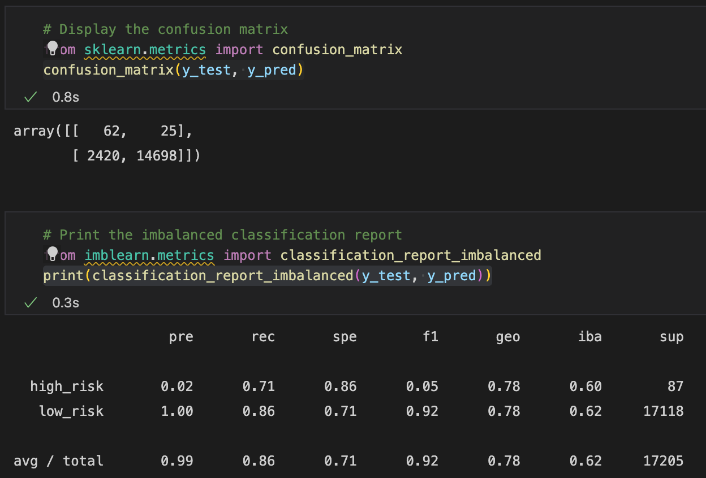
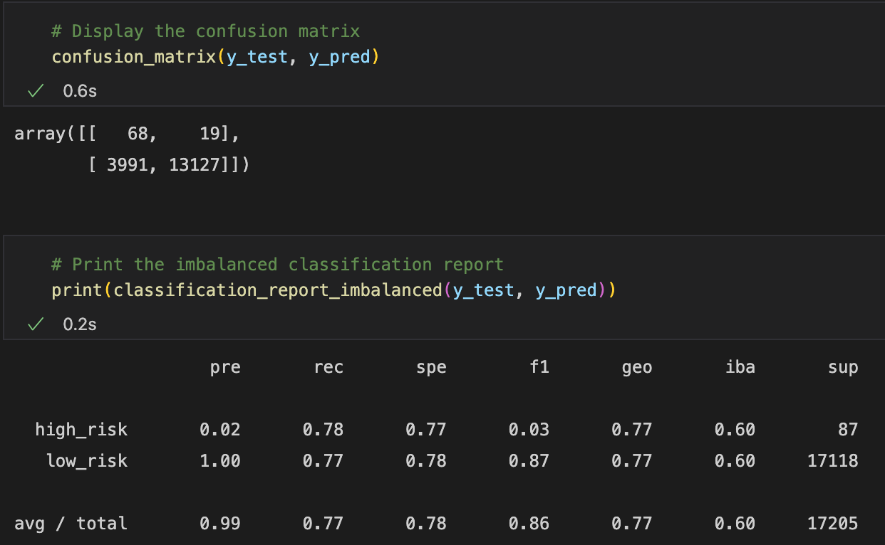
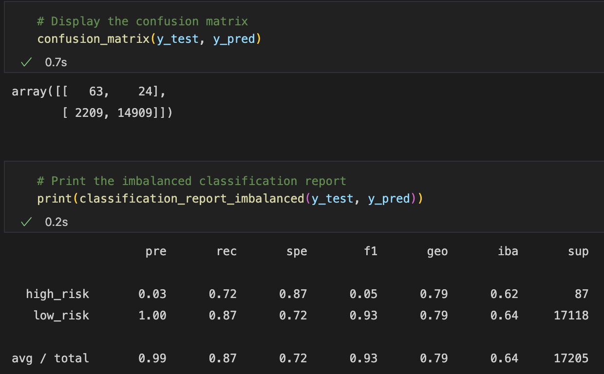
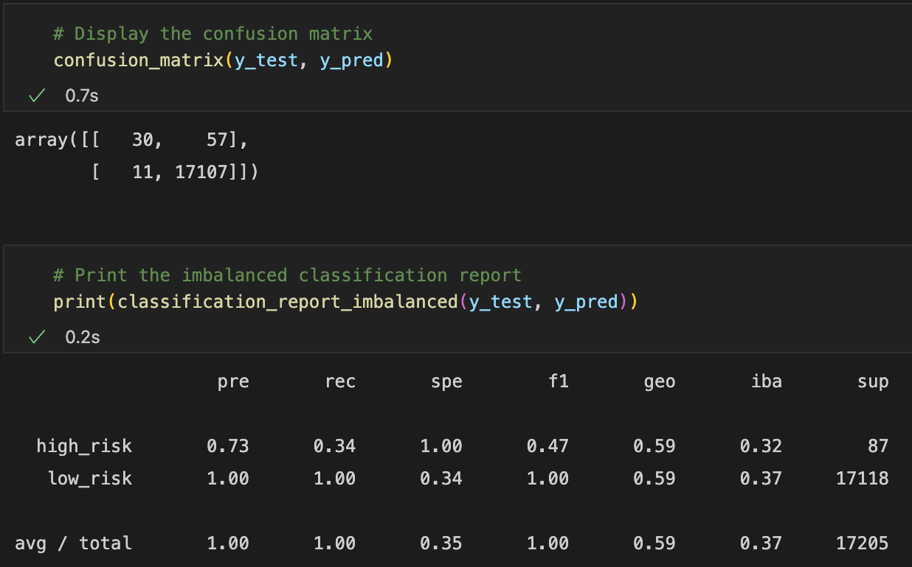
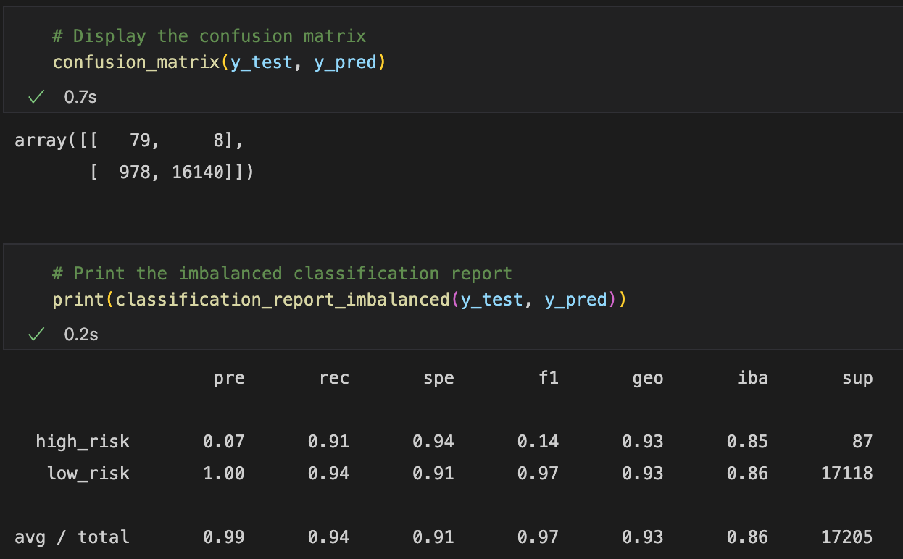
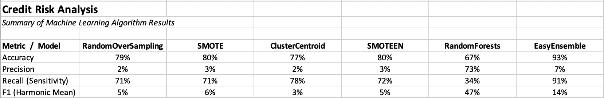

# Credit Risk Analysis

## Overview

In this project, we have compared 6 different machine learning algorithms to assess their ability to predict high credit risk credit card applicants.  In the case of predicting this type of risk, we are facing an unbalanced classification problem - most applicants will be low risk.  It is important for banks to be able to identify the few higher risk individiduals and to turn down their applications.  By training and testing a variety of algorithms, we hope to identify a model that can be deployed successfully.

## Results

The first model evaluated was an oversampling algorithm called `RandomOverSampler`.
- its accuracy score was 0.785636
- its confusion matrix and imbalanced classification report were as shown below:

  
  
The second model was an oversampling algorithm called `SMOTE`
- its accuracy score was 0.796677
- its confusion matrix and imbalanced classification report were as shown here:

  
  
The third model was an undersampling algorithm called `ClusterCentroids`
- its accuracy score was 0.774231
- its confusion matrix and imbalanced classification report were:

  

The fourth model was a combination (over and under) sampling called `SMOTEENN`
- its accuracy score was 0.797546
- it's confusion matrix and imbalanced classification report were as shown here:

  
  
The fifth model was an ensemble learner called `BalancedRandomForestClassifier`
- its accuracy score was 0.672094
- its confusion matrix and imbalanced classification report are as follows:

  
  
The final model was another ensemble learner called `EasyEnsembleClassifier`
- its accuracy score was 0.925456
- its confusion matrix and imbalanced classification report were:

  

## Summary

A summary comparison of all models is shown below:

Most of the models had moderate accuracy, with `EasyEnsembleClassifier` having a much higher accuracy result.  Most models, except the `BalancedRandomForestClassifier`, had very low precision and higher sensitivity/recall.  Given the nature of our need - we want to avoid giving credit cards to individuals who are actually high_risk, we prefer a higher precision.  If we accidentally classify someone who is low risk as high risk, they can certainly appeal our decision to deny credit or can resubmit their application after some wait period that we establish.  Based on the results and our needs, I recommend using the `BalancedRandomForestClassifier` model.  I further recommend working to improve this algorith by removing some of the features which do not contribute as much to the success of the model.  In this way, we may be able to the bank's ability to minimize risk of extending credit to risky borrowers, while also mitigating against turning away customers who are actually low risk, but have been falsely predicted to be high list.

